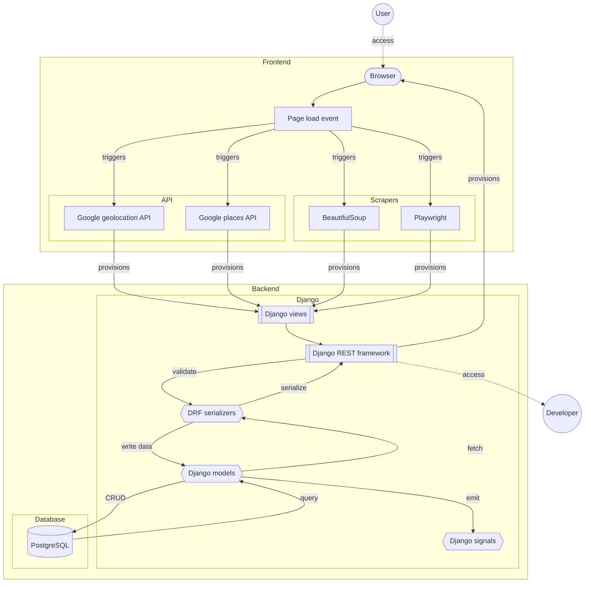

# `tako`

<p align='center'>
    
    <br>ランチに何を食べたい？
</p>

*Tako* comprises the following - 

1. *Ta*, a web app that helps you decide where to eat.   
2. *Ko*, a bevy of scrapers that extract public eating spaces in malls, colleges and other locations into a convenient [API wrapper](#api).

## Usage

### How to build it

Don't. Access the web app [here](addalinkherelater.com).

### Architecture



### API

*Ko* [scrapers](./scrapers) extract shop data to an array of json following the below structure.

```json
{
  "name": string, // establishment name
  "location": string, // establishment address
  "description": string, // detailed information (operating hours, dietary restrictions etc.)
  "category": string, // identifying category
  "url": string // web url
}
```

### Internal reference

For testing purposes.

```console
$ make config
$ make
```

## Contribute

Tako is open-source. Contribution guidelines are found at [`CONTRIBUTING.md`](./admin/CONTRIBUTING.md).