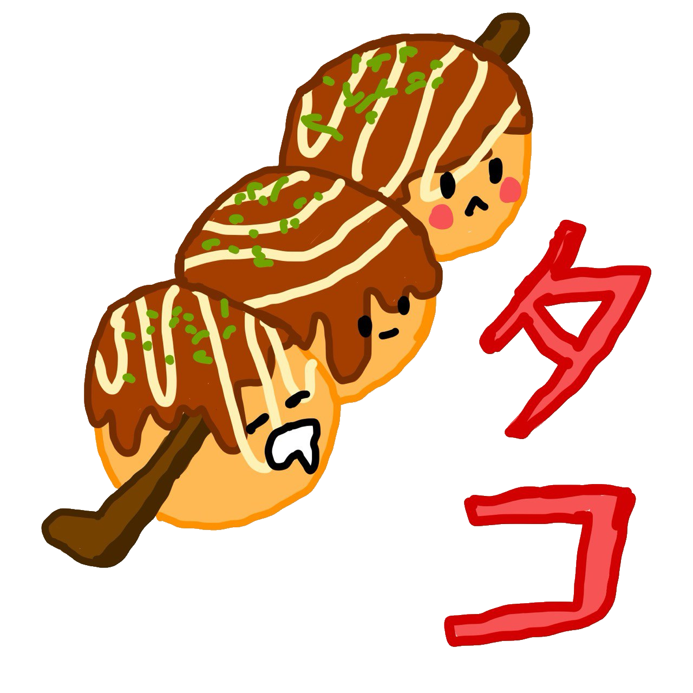

# `tako`

Tako, a web app that helps you decide where to eat.

<p align='center'>
    
    <br>ランチに何を食べたい？
</p>

## How to build it

Don't. Access the web app [here](addalinkherelater.com).

## Usage

For testing purposes.

```console
$ make config
$ make
```
