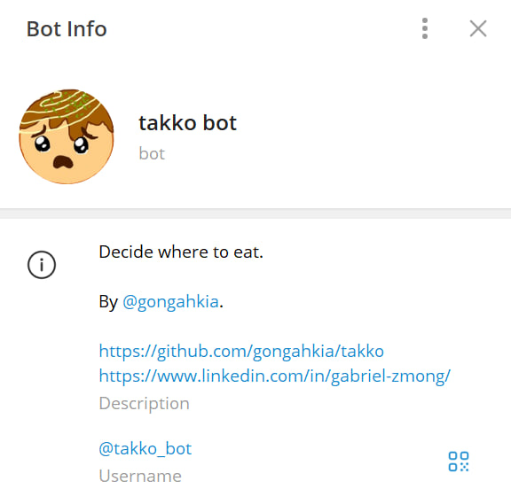
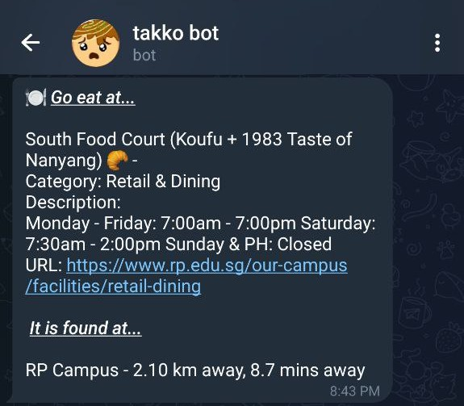
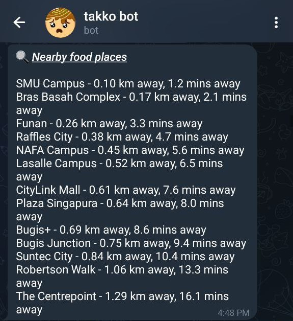

# `takko`

<p align='center'>
    
    <br>ランチに何を食べたい？
</p>

*Takko* comprises the following - 

1. *Tak*, a [telegram bot](./bot) that helps you decide where to eat.   
2. *Ko*, a bevy of [scrapers](#scrapers) that extract public eating spaces in malls, colleges and other locations into a convenient API wrapper.

## Screenshots

### About



### `Spin the wheel 🎰`



### `Food near me 🍡`



## Usage

### How to build

Don't. Access the telegram bot [here](https://t.me/takko_bot).

### For developers

#### Local deployment

*Tak* [telegram bot](./bot) can be deployed locally.

#### Scrapers

*Ko* [scrapers](./scrapers) extract shop data to an array of json following the below structure.

```json
{
  "name": string, // establishment name
  "location": string, // establishment address
  "description": string, // detailed information (operating hours, dietary restrictions etc.)
  "category": string, // identifying category
  "url": string // web url
}
```

## Contribute

Takko is open-source. Contribution guidelines are found at [`CONTRIBUTING.md`](./admin/CONTRIBUTING.md).