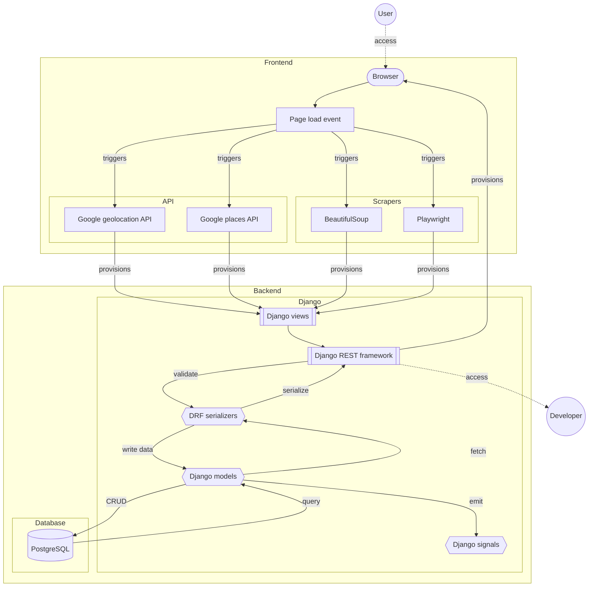

# Archive

Now deprecated.

## [`Takko` full-stack web application](./web)

* Vanilla HTML frontend, Django backend
* Retired on 03/11/2024

```mermaid
flowchart TB
    
    subgraph "Frontend"

        direction TB
        browser([Browser])
        pageLoad[Page load event]

        subgraph "API"
            geoAPI[Google geolocation API]
            placesAPI[Google places API]
        end

        subgraph "Scrapers"
            bs4[BeautifulSoup]
            pw[Playwright]
        end

    end

    subgraph "Backend"

        subgraph "Django"
            direction TB
            views[[Django views]]
            drf[[Django REST framework]]
            serializers{{DRF serializers}}
            models{{Django models}}
            signals{{Django signals}}
        end

        subgraph "Database"
            direction TB
            postgres[(PostgreSQL)]
        end
    
    end
    
    browser --> pageLoad
    pageLoad --->|triggers| geoAPI & placesAPI & bs4 & pw
    geoAPI & placesAPI & bs4 & pw -->|provisions| views
    views --> drf
    drf -->|validate| serializers
    serializers -->|write data| models
    models -->|CRUD| postgres
    models -->|emit| signals
    postgres -->|query| models
    models -->|fetch| serializers
    serializers -->|serialize| drf
    drf -->|provisions| browser
    user((User)) -.access.-> browser
    drf -.access.-> dev((Developer))
```